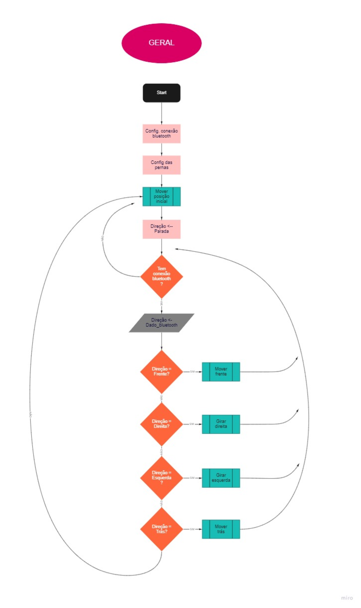
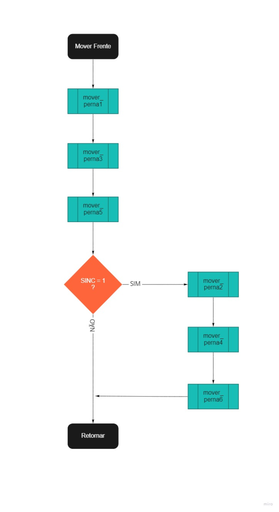

# Grupo VPX

Projeto da Formiga Mecatrônica para a matéria **SEM0544 - Sistemas Embarcados (2021)**. 

## Alunos:

* [Giovanna Martins Losacco](https://github.com/gilosacco) (nº 9783491)
* [Paulo Henrique Couto Silva](https://github.com/paulohenriquecrs) (nº 10308818)
* [Vivian Coutinho Nascimento](https://github.com/vivcoutinho) (nº )

## Proposta

A ideia do projeto é implementar a caminhada do robô formiga (com seis pernas). O hardware é composto por uma placa Toradex com compatibilidade Linux, duas MBEDS e 12 servomotores de aeromodelismo (2 em cada perna). E como ele foi decidido previamente, o foco do projeto foi na implementação do software no robô.

O trabalho então foi dividido em duas partes. A primeira pensando na lógica da movimentação para a caminhada, pensando mais nos momentos em que cada motor seria acionado. Já a segunda foi voltada mais para a comunicação entre as duas placas (e a divisão de processamento entre elas).

## Desenvolvimento

Primeiro começamos pensando na primeira parte, a lógica da movimentação para a caminhada. E antes de escrever o código em C, fizemos os diagramas abaixo para ajudar no nosso processo de desenvolvimento. O primeiro diagrama é sobre a rotina geral da leitura/tomada de decisão de acordo com o que o usuário envia para o robô. Já o segundo é mais voltado para a movimentação em si das pernas, representando a função *mover frente*. Pode-se notar que a lógica é de movimentar sempre 3 pernas intercaladas ao mesmo tempo, de forma que as outras 3 permaneçam no chão durante esse tempo para maior estabilidade da formiga.

A partir desses diagramas foi escrito o código completo com a implementação completa de cada uma das funções. As explicações mais detalhadas estão dentro do próprio código (..).

Para a segunda parte...
